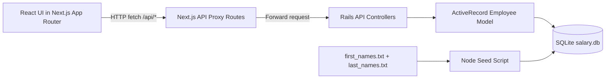

# Architecture

## Overview
The system is split into two runtime services:
- Next.js app for UI and API proxy routes.
- Rails 7 API service in `backend/` for business logic and persistence.

Both services use the same SQLite database file at `sqlite/salary.db`.

## Diagram

## Module Boundaries
- `src/components/salary-dashboard.tsx`: tab-based HR workspace UI.
- `src/app/api/*`: lightweight proxy route handlers.
- `src/lib/rails-api.ts`: proxy transport helper from Next.js to Rails.
- `backend/app/controllers/api/*`: Rails request handling, validation mapping, and response shaping.
- `backend/app/models/employee.rb`: ActiveRecord model rules and payload mapping.
- `backend/config/database.yml`: Rails DB binding to shared `sqlite/salary.db`.
- `scripts/seed.js`: deterministic, high-volume data seeding into SQLite.

## Request Flow
1. Browser calls `http://127.0.0.1:3000/api/*`.
2. Next.js proxy route forwards the same path/query to Rails (`http://127.0.0.1:3001` by default).
3. Rails validates and processes through ActiveRecord.
4. JSON response is returned through Next.js proxy back to UI.

## Data Model
`employees` table:
- `id` (PK)
- `full_name`
- `email` (unique)
- `job_title`
- `department`
- `country`
- `salary`
- `currency`
- `employment_type`
- `status`
- `hire_date`
- `created_at`
- `updated_at`

Indexes:
- `country`
- `(country, job_title)`
- `job_title`
- `department`
