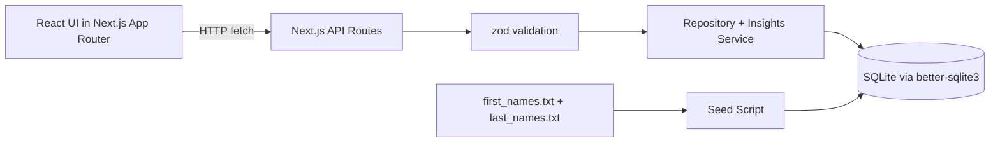

# Architecture

## Overview
A single Next.js application hosts both UI and backend APIs. SQLite is used as the relational datastore for simplicity and portability.

## Diagram

## Module Boundaries
- `src/app/api/*`: request parsing, response formatting, status codes.
- `src/lib/validation.ts`: schema/query validation.
- `src/lib/employee-repository.ts`: CRUD and list/filter queries.
- `src/lib/insights-service.ts`: salary analytics and aggregation logic.
- `scripts/seed.js`: deterministic high-volume seed process.

## Data Model
`employees` table:
- `id` (PK)
- `full_name`
- `email` (unique)
- `job_title`
- `department`
- `country`
- `salary`
- `currency`
- `employment_type`
- `status`
- `hire_date`
- `created_at`
- `updated_at`

Indexes:
- `country`
- `(country, job_title)`
- `job_title`
- `department`
